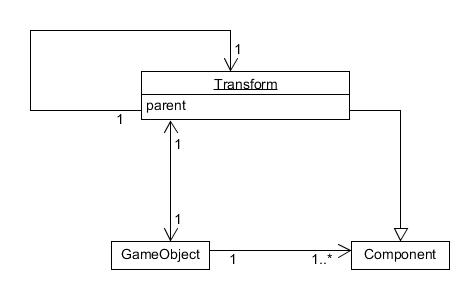

## 一、解释 游戏对象（GameObjects） 和 资源（Assets）的区别与联系。
        
* 游戏对象：游戏中的所有对象都是游戏对象，游戏对象 (GameObject)是所有其他组件 (Component) 的容器。
        
* 资源：游戏项目中会用到的所有素材。

* 联系：有些资源可作为模板，可以实例化成游戏中具体的对象。

* 区别：对象一般直接出现在游戏的场景中，是资源整合的具体表现；而资源是为对象服务而使用的，多个不同的对象可以享用共同的资源。
---

## 二、下载几个游戏案例，分别总结资源、对象组织的结构（指资源的目录组织结构与游戏对象树的层次结构）

* 游戏对象之间是父类和子类的关系，对象中一般有玩家、敌人、环境、摄像机和音乐等虚拟父类，这些父类本身没有实体，但他们的子类包含了游戏中会出现的对象。
        
* 资源文件夹通常有对象、材质、场景、声音、预设、贴图、脚本、动作，在这些文件夹下可以继续划分。
      
---

## 三、编写一个代码，使用 debug 语句来验证 MonoBehaviour 基本行为或事件触发的条件
  - 基本行为包括 Awake() Start() Update() FixedUpdate() LateUpdate()
  - 常用事件包括 OnGUI() OnDisable() OnEnable()

        using System.Collections;
        using System.Collections.Generic;
        using UnityEngine;

        public class NewBehaviourScript : MonoBehaviour {
          void Awake() {
            Debug.Log ("Awake");
          }
          void Start () {
            Debug.Log ("Start");
          }
          void Update () {
            Debug.Log ("Update");
          }
          void FixedUpdate() {
            Debug.Log ("FixedUpdate");
          }
          void LateUpdate() {
            Debug.Log ("LateUpdate");
          }
          void OnGUI() {
            Debug.Log ("OnGUI");
          }
          void Reset() {
            Debug.Log ("Reset");
          }
          void OnDisable() {
            Debug.Log ("OnDisable");
          }
          void OnDestroy() {
            Debug.Log ("OnDestroy");
          }
        }

    

---
## 四、查找脚本手册，了解 GameObject，Transform，Component 对象
  - 分别翻译官方对三个对象的描述（Description）

    答：Component是组件，Component有着很多不同的功能属性，Transform就是其中的一种。每一个GameObject有很多个不同的组件Component；而且Transform是每一个GameObject都必有的Component。

  - 描述下图中 table 对象（实体）的属性、table 的 Transform 的属性、 table 的部件
    - 本题目要求是把可视化图形编程界面与 Unity API 对应起来，当你在 Inspector 面板上每一个内容，应该知道对应 API。
    - 例如：table 的对象是 GameObject，第一个选择框是 activeSelf 属性。

    答：table的对象是GameObject,属性有activeInHierarchy, activeSelf, isStatic, layer, scene, tag, transform. 
    组件有Mesh Filter网格过滤器描述了几何体的形状, Box Collider描述了物体的碰撞范围, Mesh Renderer网格渲染器，从网格过滤器中获得几何体的形状然后根据要求进行渲染。 

  - 用 UML 图描述 三者的关系（请使用 UMLet 14.1.1 stand-alone版本出图）

    答：

---

## 五、整理相关学习资料，编写简单代码验证以下技术的实现：
  - 查找对象 
    - 通过名字查找：public static GameObject Find(string name) 
    - 通过标签查找单个对象：public static GameObject FindWithTag(string tag) 
    - 通过标签查找多个对象：public static GameObject[] FindGameObjectsWithTag(string tag)
  - 添加子对象: public static GameObect CreatePrimitive(PrimitiveTypetype)
  - 遍历对象树: 

        foreach (Transform child in transform) {
            Debug.Log(child.gameObject.name);
        }
  - 清除所有子对象:
  
        foreach (Transform child in transform) { 
            Destroy(child.gameObject);
        }

---

## 六、资源预设（Prefabs）与 对象克隆 (clone)
  - 预设（Prefabs）有什么好处？
    - Prefabs（预设）是一种资源类型，可被重复使用的游戏对象。它可以被置入多个场景中，又或者能够在一个场景中被多次置入。当你在一个场景中增加一个Prefabs，你就实例化了一个Prefabs。所有Prefabs实例都是Prefab的克隆，只要Prefabs原型发生改变，所有的Prefabs实例都会产生变化。如果大家要创建一些想要重复使用的东西，那么就该用到它了,预设方便了我们对资源的重复使用。
  - 预设与对象克隆 (clone or copy or Instantiate of Unity Object) 关系？
    - 克隆：克隆的N个物体是N个相互独立的对象。没有任何关联的对象。在内存里存储为N份，相当于new了N个。
    - 预设：预设出的N个物体，这些物体与预设对象是有关系的。即：修改原始的预设对象，实例化出的N个对象是立即发生变化的。实例化出来的N个对象也是可以自由修改的，从而也不会影响原始的预设对象，很方便。
  - 制作 table 预制，写一段代码将 table 预制资源实例化成游戏对象
    - 

---

## 七、尝试解释组合模式（Composite Pattern / 一种设计模式）。使用 BroadcastMessage() 方法
  - 向子对象发送消息